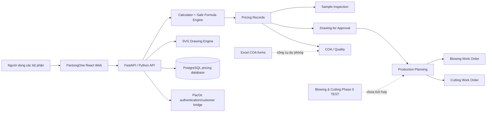

# PANTONGONE — Kiến trúc và tổng hợp yêu cầu mới nhất

**Ngày tổng hợp:** 2026-09-30  
**Trạng thái tài liệu:** UAT / nghiệm thu chức năng nội bộ  
**Nguồn đối chiếu:** mã nguồn hiện tại, file bàn giao và các cuộc chat liên quan của CEO

> Tài liệu này mô tả phiên bản mới nhất đang có trong workspace. Nó không phải bằng
> chứng rằng bản này đã được triển khai lên `price.pantongone.com`.

## 1. Các session chính đã tạo nên hệ thống

| Session | Thread ID | Nội dung đóng góp |
|---|---|---|
| PANTONGONE – พัฒนาโปรแกรมต่างๆ | `01a03fd5-e8b5-7980-9c6c-f16dc5c25022` | Nền tảng tính giá, desktop calculator, web clone, lịch sử báo giá, công thức, đóng gói và Blowing & Cutting Register TEST |
| PantongOne — Master Integration | `01a04705-9da4-77b2-9009-7103b87d7fc1` | Tích hợp Pricing, Sample Inspection, Drawing, Planning, COA, History và luồng revision |
| Drawing for Approval for Daikin | `01a046e5-0d4f-78f2-8c3f-0b5e54782863` | Chuẩn Drawing/COA PE BAG, A4, kích thước, dung sai và điểm đo chiều dài |
| DRAWING FOR APPROVAL | `01a03ac1-d883-7283-9d04-698b4a506af6` | Chuẩn mẫu Drawing của PANTONG THAI PACK và quy tắc giữ bố cục đã duyệt |
| SAMPLE PRODUCTION REQUEST | `01a03a8e-14e9-7380-8ebb-92003ed38fd2` | Biểu mẫu yêu cầu làm mẫu và luồng kiểm tra trước khi khách hàng duyệt |
| ใบรายการเป่าถุง | `01a0637f-7ade-7160-add8-915f275e1d2f` | Phiếu thổi màng, công thức sản xuất, file PDF và tổ chức dữ liệu sản xuất |
| วางแผนจัดเครื่องเป่าและตัด | `01a0404c-0995-7432-94be-210cac3e778b` | Nhu cầu lập kế hoạch máy thổi và máy cắt |

Các session trên không tạo ra một file duy nhất ngay từ đầu. Chức năng được phát
triển qua nhiều workspace và sau đó gom dần vào PantongOne.

## 2. Phân biệt các sản phẩm phần mềm

### 2.1 PantongOne Web — hệ thống mục tiêu chính

Workspace hiện tại:

`2026-08-28/coa-certificate-of-analysis/pantongone-source`

Các mô-đun:

1. Pricing / คำนวณราคา
2. Sample Inspection / ตรวจตัวอย่าง
3. Drawing for Approval / แบบขออนุมัติ
4. Production Planning / ข้อมูลวางแผนการผลิต
5. COA & Quality / ใบรับรองคุณภาพ
6. Quote History / ประวัติ
7. Phiếu công việc cho bộ phận thổi và cắt

Đây là hệ thống cần tiếp tục hoàn thiện để trở thành nguồn dữ liệu trung tâm.

### 2.2 ThaiPlasticPricing Desktop — chương trình tính giá độc lập

Đây là ứng dụng Windows có thể đóng gói thành `.exe`, sử dụng công thức Python và
SQLite cục bộ. Nó là nguồn gốc của phần công thức tính giá. Web không được tự viết
lại công thức theo cách khác vì sẽ gây sai lệch giữa desktop và server.

### 2.3 Blowing & Cutting Register — Phase 0 TEST

File chính:

`PANTONG_REGISTER_TEST.html`

Đặc điểm:

- Chạy trực tiếp trong trình duyệt bằng file cục bộ.
- Lưu dữ liệu trong browser/local storage của máy đang dùng.
- Có tạo, lưu, sửa, tìm, in phiếu và ghi kết quả sản xuất.
- Có mẫu CSV, xuất PDF/Excel và bộ QA in A4.
- Chưa kết nối cơ sở dữ liệu PantongOne.
- Không được coi là bản production hoặc nguồn dữ liệu trung tâm.

### 2.4 Bộ Excel/PDF COA

Các file `COA_DATA_INPUT_FORM*.xlsx/.xlsm` và PDF mẫu là công cụ hỗ trợ độc lập.
Chúng vẫn cần thiết khi người dùng muốn làm việc bằng Excel hoặc khi PantongOne chưa
triển khai hoàn chỉnh.

## 3. Kiến trúc mục tiêu



## 4. Luồng nghiệp vụ mới nhất

```text
Khách hàng / mã hàng
        ↓
Tính giá thử hoặc tính giá chính thức
        ↓
Lưu QT-YYYYMMDD-NNNN và lịch sử revision
        ↓
Làm mẫu và Sample Inspection khi khách yêu cầu
        ↓
Drawing for Approval để khách xác nhận
        ↓
Production Planning lấy dữ liệu từ báo giá + Drawing đã duyệt
        ↓
Phiếu bộ phận thổi → phiếu bộ phận cắt → đóng gói
        ↓
QC nhập kết quả thực tế → COA theo từng lot → giao hàng
```

Quy tắc quan trọng:

- Pricing là nguồn dữ liệu ban đầu; các bước sau không nhập lại nếu đã có nguồn.
- Sample/Drawing có thể được làm trước khi báo giá được duyệt nếu khách yêu cầu.
- COA dùng sau sản xuất, theo từng lot giao hàng.
- Dữ liệu thực đo không được tự tạo hoặc giả định.
- Revision phải giữ số tham chiếu và lịch sử, không ghi đè mất dữ liệu cũ.

## 5. Công nghệ sử dụng

### Frontend PantongOne

- React 19
- TypeScript 5.9
- Vite 7
- CSS thuần theo component
- Vitest, Testing Library, jsdom
- Lucide/Iconify cho icon
- Browser print cho biểu mẫu A4/PDF

### Backend PantongOne

- Python
- FastAPI 0.120
- Uvicorn
- Pydantic request validation
- Psycopg 3 + connection pool
- PostgreSQL cho production
- SQL migrations cho quotations, drawings, COA và Sample Inspection
- SVG generator tự viết cho Drawing for Approval
- Formula engine giới hạn biến/phép toán, không chạy mã tùy ý

### Hạ tầng

- Docker / Docker Compose
- Nginx reverse proxy
- PacOs authentication và permission bridge
- Đường dự kiến: `/pricing-api/` trong hệ thống PantongOne/PacOs
- Backup PostgreSQL trước deploy

### Local/UAT

- Python mock API
- SQLite cho dữ liệu lịch sử local
- JSON cho saved visual-review records
- Vite dev server tại `127.0.0.1:5174`

### Desktop và tài liệu

- Python/Tkinter cho ThaiPlasticPricing desktop
- SQLite cho dữ liệu desktop
- PyInstaller cho `.exe`
- Excel `.xlsx/.xlsm`
- HTML/CSS/JavaScript và local storage cho Blowing & Cutting Phase 0 TEST
- PDF/SVG/browser print cho biểu mẫu

## 6. Chức năng đã phát triển theo yêu cầu CEO

### Pricing

- Tính thử không lưu và tính chính thức có lưu.
- Chọn khách hàng/mã khách hàng.
- Lưu tên hàng, mã hàng, kích thước, đơn vị và loại sản phẩm.
- Hỗ trợ inch, cm, mm, metre và micron theo trường phù hợp.
- Phân biệt độ dày `per side` và `per pair`.
- Tính trọng lượng/chiếc, số chiếc/kg, số sau khấu trừ, giá/chiếc và giá/kg.
- Khấu trừ sản xuất mặc định 10%, có bật/tắt hoặc thay đổi theo nghiệp vụ cho phép.
- Tính số lượng và trọng lượng gói/bao.
- Công thức có thể cấu hình bằng bộ biến an toàn.
- Lưu, revision, tìm kiếm, mở lại, xóa và in A4.

### Product types mới nhất

Thứ tự hiển thị:

1. ถุงพลาสติกเปิดปากตรง / Plastic Bag
2. ถุงพับข้าง / Gusset Bag
3. ปลอกพลาสติกเปิดสองด้าน / Open-Ended Plastic Sleeve
4. แผ่นพลาสติก / Plastic Sheet
5. ม้วนพลาสติก / Plastic Roll
6. ถุงคลุมสินค้า / Product Cover

Open-Ended Plastic Sleeve sử dụng hai lớp vật liệu như túi nhưng không có đường hàn
đáy và không cộng bottom allowance.

### Sample Inspection

- Chọn báo giá đã lưu hoặc revision làm nguồn.
- Tự đưa khách hàng, mã hàng và nominal specification sang phiếu.
- Hiển thị dung sai trước khi nhập kết quả.
- Hỗ trợ một hoặc ba mẫu.
- In phiếu trống để mang ra khu vực đo.
- Lưu, sửa, xóa và in kết quả.

### Drawing for Approval

- Tạo từ báo giá đã lưu.
- Cấp số DFA, revision và ngày.
- Hỗ trợ điểm đo Opening-to-Seal / Opening-to-Bottom.
- Hình 2D; một số loại túi có tùy chọn minh họa 3D.
- Hiển thị nominal, tolerance, vật liệu, màu, printing và special requirements.
- Open-ended sleeve có OPEN TOP và OPEN BOTTOM, không có seal line.
- In A4 landscape.

### Production Planning và work orders

- So sánh customer specification với production-order specification.
- Không hiển thị giá bán trên phiếu sản xuất.
- Cho phép điều chỉnh kích thước/độ dày thực tế dùng sản xuất.
- Dung sai chiều rộng, dài, dày và gusset đi từ nguồn đã duyệt.
- Quản lý pcs/kg, grams/pc, số chiếc/bao, số gói/bao và trọng lượng/bao.
- Chọn giữ packaging đã báo giá hoặc nhập packaging mới.
- In phiếu bộ phận thổi và bộ phận cắt.
- Hiển thị loại sản phẩm trên phiếu sản xuất.

### COA / Quality

- Số Certificate tự động.
- Ngày kiểm tra, lot/batch, ngày sản xuất và số lượng.
- Nominal, specification limits, actual result và PASS/FAIL.
- Actual result để trống nếu chưa đo.
- Checked by, Approved by và Remarks.
- In A4 và lưu lịch sử COA.

## 7. Những lưu ý và lỗi đã sửa

### Công thức và đơn vị

- Plastic Sheet là một lớp: không nhân hai.
- Plastic Bag/Gusset/Sleeve là hai lớp khi tính theo độ dày mỗiด้าน.
- Khi nhập thickness per pair, chương trình quy đổi đúng sang per side trước khi dùng
  công thức hai lớp; không nhân đôi lần thứ hai.
- Bottom allowance chỉ thuộc loại túi có đáy cần cộng; open-ended sleeve không dùng.
- Không dùng công thức túi hàn đáy choปลอกเปิดสองด้าน.
- Đơn vị khách hàng được giữ để hiển thị; giá trị chuẩn nội bộ được quy đổi an toàn.
- Các bảng giá hiển thị số thập phân hai chữ số nhưng phép tính dùng giá trị đầy đủ.

### Dữ liệu và lịch sử

- Báo giá revision phải dùng được ở Sample Inspection và Drawing.
- Save không được giữ trạng thái sửa cũ làm mất dữ liệu.
- Số QT cấp bằng counter transaction để tránh trùng khi lưu đồng thời.
- Server tính lại kết quả khi lưu; không tin số do browser gửi lên.
- Dữ liệu chưa lưu không được coi là lịch sử chính thức.
- Không refresh trang khi form đang Unsaved nếu chưa sao lưu hoặc bấm Save.

### Giao diện

- Menu chính chuyển sang cột trái để chọn mô-đun dễ hơn.
- Customer & Document được làm gọn để giảm cuộn trên màn hình desktop.
- Màu tím được loại khỏi dải thao tác; dùng xanh/xám/đỏ thương hiệu.
- Các nút Save, Edit, Delete, Print và Back phải có ở màn hình phù hợp.
- Kích thước checkbox PASS/FAIL phải đủ dùng nhưng không quá lớn.
- Bảng có dải màu nhạt, chữ rõ, tiêu đề căn giữa.

### In và tài liệu

- Biểu mẫu chính dùng A4 portrait hoặc landscape theo nội dung.
- Nhiều trang phải có `Page X / Y`.
- Hiển thị ngày và giờ in.
- Logo đỏ và tên `PANTONG THAI PACK CO., LTD.` phải rõ, cùng một dòng khi phù hợp.
- Không giả định dữ liệu thiếu: lot, ngày, số lượng, actual result hoặc mã hàng phải để trống.

### Lỗi vận hành đã gặp

- Frontend đã biết product key `sleeve` nhưng API cũ còn chạy nên báo `'sleeve'`.
  Cần restart đúng API sau khi thay đổi product type.
- Port 5174 có thể chạy trong khi API phía sau không chạy, khiến `/api/meta` trả 500.
- Source/build test không chứng minh giao diện đang mở đã nhận bản mới; phải kiểm tra URL,
  port owner và response đang phục vụ.
- Blowing & Cutting Phase 0 lưu trong browser; xóa browser data có thể làm mất dữ liệu.

## 8. Trạng thái phiên bản mới nhất

### Đã có trong source

- Sáu mô-đun PantongOne chính.
- API, migrations và local test data.
- Loại Open-Ended Plastic Sleeve.
- Work order cho thổi/cắt.
- COA và Sample Inspection.
- Bộ Excel/PDF COA và Drawing mẫu.

### Chưa đủ điều kiện xác nhận production

- Các thay đổi local hiện chưa phải bằng chứng đã push/deploy lên GitHub hoặc server.
- Cần sửa hết TypeScript build errors và chạy lại test suite.
- Cần khởi động và kiểm tra frontend + API cùng phiên bản.
- Cần kiểm tra trực quan tất cả bản in A4 cuối.
- Cần migration thử trên bản sao database trước production.
- Cần xác nhận backup/restore và phân quyền PacOs.
- Blowing & Cutting Phase 0 vẫn là hệ thống TEST độc lập.

## 9. Checklist nghiệm thu đề xuất

1. Pricing: thử đủ sáu product types và cả per-side/per-pair.
2. Save/revision: tạo QT, sửa, giữ bản cũ và mở lại được.
3. Sample: chọn revision, in blank, lưu ba kết quả và PASS/FAIL.
4. Drawing: kiểm hình, đơn vị, tolerance, seal/datum và A4.
5. Planning: dữ liệu nguồn đúng, không lộ giá, packaging và weight comparison đúng.
6. Work order: phiếu thổi/cắt có product type, tolerance và package data.
7. COA: số tự động, lot/date, actual result trống trước đo và in A4.
8. History: tìm, lọc, details, edit/revision và delete theo quyền.
9. Backup/restore: PostgreSQL, local SQLite/JSON và dữ liệu Phase 0.
10. Deploy: build sạch, test sạch, migration, health check và xác minh URL production.

## 10. Nguồn file chính

- PantongOne source: `pantongone-source/`
- Frontend: `pantongone-source/pantongone-frontend/`
- API: `pantongone-source/server/api/`
- Calculator/Drawing core: `pantongone-source/server/core/`
- Database migrations: `pantongone-source/server/api/migrations/`
- COA/Drawing/Excel outputs: `outputs/`
- Phase 0 register package:
  `2026-08-27/plastic-bag-pricing-desktop/outputs/PANTONG_BLOW_CUT_REGISTER_PHASE0_TEST_PACKAGE_2026-09-04/`

